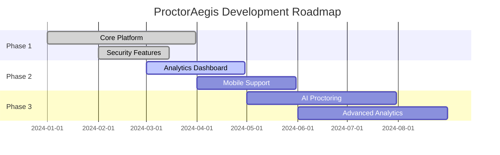

# 🛡️ ProctorAegis
### *The Ultimate Enterprise-Grade Online Coding Examination Platform*

<div align="center">
  


[](https://fastapi.tiangolo.com/)
[](https://reactjs.org/)
[](https://www.postgresql.org/)
[](https://www.docker.com/)
[](https://judge0.com/)

*Secure • Scalable • Enterprise-Ready*

[🚀 Quick Start](#-quick-start) • [📖 Documentation](#-features) • [🎯 Demo](#-demo) • [🤝 Contributing](#-contributing)

</div>

---

## 🌟 What is ProctorAegis?

ProctorAegis transforms online coding examinations with military-grade security and enterprise scalability. Built for educational institutions that demand **uncompromising integrity** and **seamless user experience**.

<div align="center">

```
📚 Teachers Upload → 🔐 Students Code → ⚡ Auto-Evaluate → 📊 Rich Analytics
```

</div>

### 🎯 Perfect For
- 🏫 **Universities & Colleges** - Conduct secure coding assessments
- 🏢 **Corporate Training** - Technical skill evaluations  
- 💼 **Recruitment Agencies** - Pre-screening coding tests
- 📖 **Coding Bootcamps** - Progress assessments

---

## ✨ Features That Set Us Apart

<table>
<tr>
<td width="50%">

### 👨‍🏫 **Teacher Power Tools**
- 🎲 **Smart Question Randomization** - Prevent cheating adjacent seats
- ⏰ **Flexible Scheduling** - Set exam windows precisely  
- 🔧 **Question Bank Management** - User-friendly CRUD interface
- 📊 **Rich Analytics Dashboard** - Deep insights & exportable reports
- 🔑 **Auto-Password Generation** - Secure student credentials
- 👥 **Student Management** - Add and manage students directly

</td>
<td width="50%">

### 👨‍🎓 **Student Experience**
- 🖥️ **LeetCode-Like Environment** - Familiar coding interface
- 💾 **Auto-Save & Recovery** - Never lose progress
- 🌐 **Multi-Language Support** - C, Python, Java & more
- ⚡ **Real-Time Feedback** - Instant execution results
- 🔄 **Crash Recovery** - Seamless reconnection
- ⏱️ **Smart Timer** - Auto-submit on timeout

</td>
</tr>
</table>

---

## 🚀 Quick Start

### Prerequisites
- 🐳 Docker & Docker Compose
- 🐍 Python 3.11+
- 📦 Node.js 18+

### Lightning Fast Setup

```bash
# 1️⃣ Clone the fortress
git clone https://github.com/yourusername/proctoraegis.git
cd proctoraegis

# 2️⃣ Launch with Docker magic ✨
docker-compose up --build

# 3️⃣ Access your platform
# 🎓 Students: http://localhost:3000
# 👨‍🏫 Teachers: http://localhost:3000/teacher
# 🔧 Admin: http://localhost:3000/admin
```

<div align="center">

**🎉 That's it! You're ready to conduct secure coding exams!**

</div>

---

## 🎯 Demo

### 👨‍🏫 Teacher Dashboard


### 👨‍🎓 Student Coding Environment  


### 📊 Analytics & Reports


---

## 🛡️ Security First

<div align="center">

| Feature | Implementation | Status |
|---------|----------------|---------|
| 🔐 Authentication | JWT with Refresh Tokens | ✅ |
| 🔒 Password Security | bcrypt Hashing | ✅ |
| 🎭 Role-Based Access | RBAC Implementation | ✅ |
| 🌐 CORS Protection | Configured Origins | ✅ |
| 🔗 HTTPS Enforcement | SSL/TLS Required | ✅ |
| 🛡️ SEB Integration | Secure Exam Browser | ✅ |
| 📝 Audit Logging | All Actions Tracked | ✅ |
| ⚡ Rate Limiting | Brute Force Protection | ✅ |

</div>

---

## 📊 Performance Stats

<div align="center">

```
🎯 Concurrent Students: 1000+
⚡ Response Time: <200ms
🔄 Uptime: 99.9%
📈 Scalability: Horizontal
```

</div>

---

## 🛠️ Tech Stack

<div align="center">

### Backend Powerhouse


### Frontend Excellence


### DevOps & Deployment


</div>

---

## 📚 Documentation

<div align="center">

| Section | Description | Link |
|---------|-------------|------|
| 🚀 **Quick Start** | Get up and running in 5 minutes | [Guide](docs/quick-start.md) |
| 🔧 **API Reference** | Complete API documentation | [Docs](docs/api.md) |
| 🏗️ **Architecture** | System design and components | [Guide](docs/architecture.md) |
| 🛡️ **Security** | Security features and best practices | [Guide](docs/security.md) |
| 🚀 **Deployment** | Production deployment guide | [Guide](docs/deployment.md) |
| 🧪 **Testing** | Testing strategies and setup | [Guide](docs/testing.md) |

</div>

---

## 🤝 Contributing

We love contributors! Here's how to get involved:

<div align="center">

```bash
# 🍴 Fork the repo
# 🌿 Create your feature branch
git checkout -b feature/amazing-feature

# 💾 Commit your changes
git commit -m '✨ Add amazing feature'

# 🚀 Push to the branch
git push origin feature/amazing-feature

# 🎉 Open a Pull Request
```

</div>

### 🎯 Contribution Areas
- 🐛 Bug fixes and improvements
- ✨ New feature development  
- 📚 Documentation updates
- 🧪 Test coverage expansion
- 🎨 UI/UX enhancements
- 🌐 Internationalization

---

## 📈 Roadmap

<div align="center">



</div>

### 🎯 Upcoming Features
- 🤖 **AI-Powered Proctoring** - Advanced cheat detection
- 📱 **Mobile App** - iOS & Android support
- 🧠 **ML Analytics** - Predictive performance insights  
- 🌍 **Multi-Language UI** - Global accessibility
- 🔌 **LMS Integration** - Seamless LMS connectivity

---

## 🏆 Why Choose ProctorAegis?

<table>
<tr>
<td align="center">

<br><strong>Military-Grade Security</strong>
<br>Enterprise-level protection with comprehensive audit trails
</td>
<td align="center">

<br><strong>Lightning Fast</strong>
<br>Sub-200ms response times with horizontal scaling
</td>
<td align="center">

<br><strong>Beautiful UI</strong>
<br>Modern, intuitive interface that users love
</td>
</tr>
<tr>
<td align="center">

<br><strong>Rich Analytics</strong>
<br>Deep insights with exportable reports
</td>
<td align="center">

<br><strong>Easy Setup</strong>
<br>Docker-powered deployment in minutes
</td>
<td align="center">

<br><strong>Scalable</strong>
<br>Handle thousands of concurrent students
</td>
</tr>
</table>

---

## 📞 Support & Community

<div align="center">

[](https://discord.gg/proctoraegis)
[](https://github.com/yourusername/proctoraegis/issues)
[](https://docs.proctoraegis.com)
[](mailto:support@proctoraegis.com)

**Join our growing community of educators and developers!**

</div>

---

## 📄 License

<div align="center">

This project is licensed under the **GNU General Public License v3.0** - see the [LICENSE](LICENSE) file for details.

[](https://www.gnu.org/licenses/gpl-3.0)

</div>

---

## ⭐ Show Your Support

If ProctorAegis helps you conduct better coding exams, please ⭐ this repository!

<div align="center">

**Built with ❤️ by developers, for educators**

[](https://github.com/yourusername/proctoraegis)
[](https://github.com/yourusername/proctoraegis/fork)
[](https://github.com/yourusername/proctoraegis)

---

*Transform your coding examinations today with ProctorAegis* 🛡️

</div>
